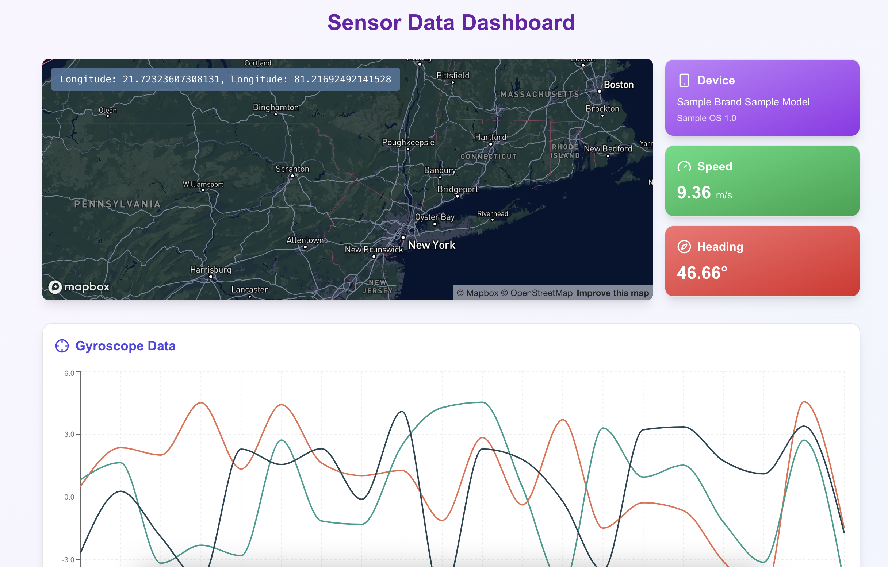

# Sensor Stream

Sensor Stream is a multi-platform application designed to collect, visualize, and analyze sensor data from mobile devices. The project consists of three main components:

1. **Sensor Mobile**: A React Native application built with Expo that collects sensor data from mobile devices, such as accelerometer, gyroscope, and GPS data.
2. **Sensor Web**: A Next.js web application that visualizes the collected sensor data in real-time using charts and maps.
3. **Sensor Server**: A Flask server that receives sensor data from the mobile application and stores it in a CSV file for further analysis.

## Features

### Sensor Mobile

- Collects data from various sensors (accelerometer, gyroscope, GPS).
- Displays real-time sensor data on the mobile device.
- Sends sensor data to the server for storage and analysis.

### Sensor Web

- Visualizes sensor data using interactive charts and maps.
- Displays device information and sensor readings in real-time.
- Provides a user-friendly interface for monitoring sensor data.

### Sensor Server

- Receives sensor data from the mobile application via WebSocket.
- Stores sensor data in a CSV file for further analysis.
- Provides a simple API for retrieving stored sensor data.

## Getting Started

### Prerequisites

- Node.js and npm
- Python and pip
- Expo CLI

### Installation

1. **Clone the repository**:

   ```sh
   git clone https://github.com/yourusername/sensor-stream.git
   cd sensor-stream
   ```

2. Install dependencies for Sensor Mobile:

   ```sh
   cd sensor-mobile
   npm install
   npx expo start # start the mobile app
   ```

3. Install dependencies for Sensor Web

   ```sh
   cd ../sensor-web
   npm install
   npm run dev # start the web app
   ```

4. Install dependencies for Sensor Server

   ```sh
   cd ../sensor-server
   pip install -r requirements.txt
   python app.py
   ```

### Usage

- Open the Sensor Mobile application on your mobile device to start collecting sensor data.
- Access the Sensor Web application in your browser to visualize the collected data.
- Monitor the server logs to see the incoming sensor data and storage status.

### Contributing

Contributions are welcome! Please open an issue or submit a pull request on GitHub.

### License

This project is licensed under the MIT License. See the LICENSE file for details.

### Screenshots


_Sensor Stream Web Dashboard showing real-time sensor data visualization_


_Demo of the working app_
