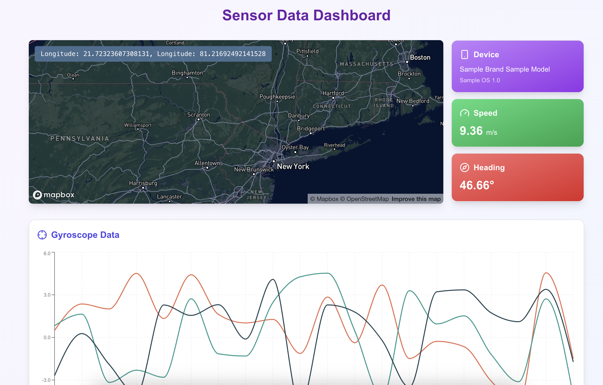

# Sensor Stream Server(backend)

- Flask
- Python
- Plotly

## Screenshots

_Sensor Stream Web Dashboard showing real-time sensor data visualization_

_Demo of the working app_

## Mobile Screenshot

   

[Demo Video](https://drive.google.com/file/d/1rCW1SEvG0An0Lh3ZGs52VYfu9jOEeTix/view?usp=sharing)

## Visualization Plots

_Acceleration over time_

_Rotation Speed_

| **Sensor**        | **Description**                                                                                                       | **Applications**                                                                                                |
| ----------------- | --------------------------------------------------------------------------------------------------------------------- | --------------------------------------------------------------------------------------------------------------- |
| **Accelerometer** | Measures acceleration forces, including gravity, to detect movement, orientation, and tilt.                           | Used in mobile devices for screen orientation, fitness trackers, gaming, and vehicle crash detection.           |
| **Gyroscope**     | Measures the rate of rotation around the device's axes, providing information about orientation and angular velocity. | Used in navigation systems, virtual reality (VR), drones, and gaming controllers for precise movement tracking. |
| **GPS**           | Provides geographical location (latitude, longitude) and altitude data using signals from satellites.                 | Used in navigation apps, location tracking, geotagging, and outdoor activities like hiking and driving.         |
